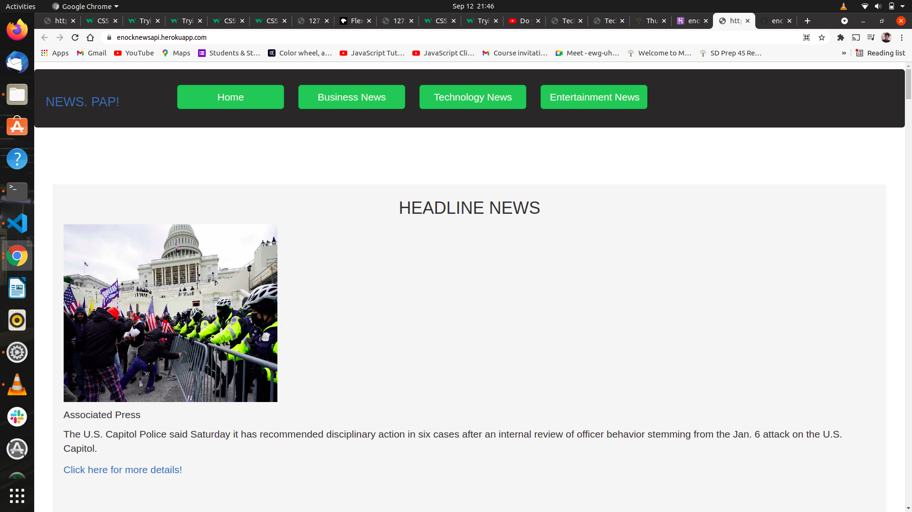

## PROJECT TITLE
NEWS. PAP!
## AUTHOR
Enock Kipronoh
 ## Description
NEWS. PAP! is a web application that displays a list of various news sources. Upon clicking a news source, it feeds you with the top news . With it is a link below the article that redirects to the news site that one reads more. It is by using https://newsapi.org/ news site that this can be achieved by consuming the news api.
## Screenshots
 

## Specifications
| Behavior | Input | Output |
| :---------------- | :----------------: |  ----------------:|
| Show news sources | ** Upon page load** | List of various news sources is diplayed |
| Display tabs with news by category |  **On Tab link click** | Clickable links to open news based on category | 
| Display articles from a news source | **Click a news source** | Redirected to a page with articles from the source |
| Display the preview of an article | **On page load** | Each article displays an image,description and publication date |
| To Read an entire article  | **Click an article** | Redirected to the news source's site to read the entire article |
## Installation Requirements
* python3.8
* pip
* python3.8 -m venv --without-pip virtual
# Cloning
In your terminal: 
    $ git clone  https://github.com/encok/News-API  
    $ cd News-API
## Running the application
first activate the virtual environment:  
    * $ source virtual/bin/activate  
* Installing flask and other dependencies  
    $ pip install Flask  
    $ pip install Flask-Bootstrap   
    $ pip install Flask-script  
   ## NOTE:   
      **The flask and flask bootstrap depends on the python version and it could bring incompatibility errors when wrong versions are installed**
* Getting the api key  
      One needs an api key so as to consume the news api.  
       * Visit https://newsapi.org/ and sign up.  
       * In the news api website, generate an api key and then copy the key.  
       * Create a start.sh file in the root directory and add this lines  
            export NEWS_API_KEY='<Your-Api-Key>'
            python3.8 manage.py server  
        * replace the api key with the api key you generated from thr site.  
* In order to run the application from the  terminal, :   
        $ export NEWS_API_KEY=<Your api key>  
        $ chmode +x start.sh  
        $ ./start.sh  
## For the apllication Test
 * To run the tests for the class files :  
        $ python3.8 manage.py test
## Technologies used
* python 3.8
* flask
## License Link

https://github.com/encok/News-API/blob/master/LICENSE

          

